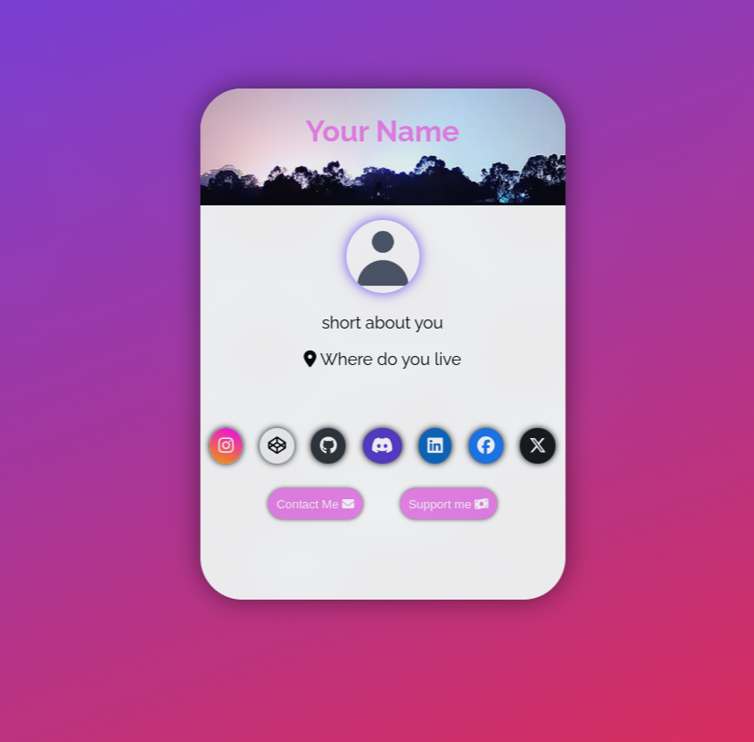

# Profile card
Profile card project. free to use, but u have to give me some credit

# How to use

<h3>How to add a custom profile picture?</h3>

Go to files and replace <code>pfp.webp</code> with your own image (it has to be named <code>pfp.webp)</code>

 
<h3>How to add your name?</h3>

Go to index.html to line 14. There replace the `Your name` text with your own

 
<h3>How to add your about me</h3>

Go to index.html to line 21 and there do the same as with the name

 
<h3>How to add custom location?</h3>

Do the same as with the other ones but on line 22

<h1>screenshot</h1>

<a href="#" class="buttonClass" style="
.buttonClass {
  font-size:15px;
  font-family:Arial;
  width:200px;
  height:37px;
  border-width:1px;
  color:#fff;
  border-color:rgba(144, 19, 254, 1);
  border-top-left-radius:17px;
  border-top-right-radius:17px;
  border-bottom-left-radius:17px;
  border-bottom-right-radius:17px;
  text-shadow:inset 0px 1px 0px #263666;
  background:linear-gradient(rgba(137, 108, 219, 1), #415989);
}
.buttonClass:hover {
  background: linear-gradient(#415989, rgba(137, 108, 219, 1));
}">Join my discord server</a>
